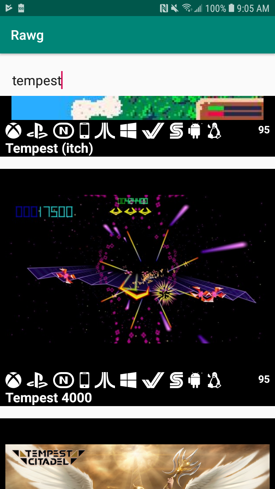

# Rawg_Android

Quick implementation of the Rawg game database search app for android.
The app's initial functionality is implemented using:
Koin
Kotlin coroutines
Retrofit's suspenstion methods
Glide
Constraint layout
Lifecycle viewmodels

