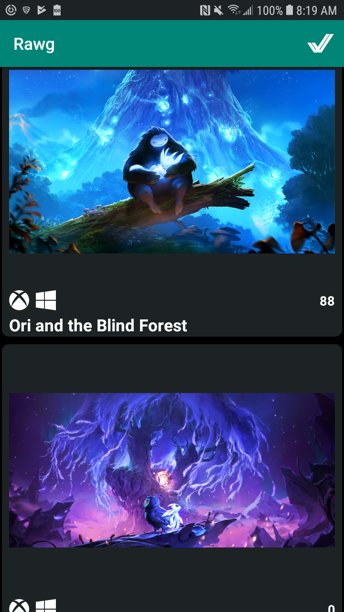
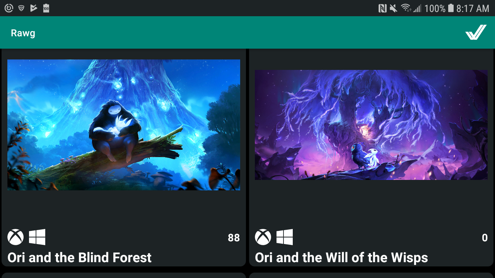

# Rawg.io for Android

Quick implementation of the [rawg.io](rawg.io) game database search app for android.
The app's initial functionality is implemented using:

* Koin
* Kotlin coroutines
* Retrofit's suspension methods
* Glide
* Constraint layout
* Lifecycle viewmodels

    

    

